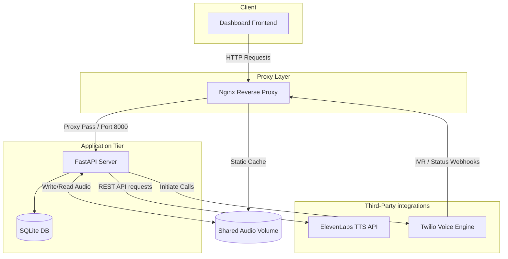

# VetPay Automated Outbound Call Agent

An enterprise-ready FastAPI-based automated outbound calling system designed to contact pet owners regarding payment updates. The system initiates calls based on loaded CSV records, plays personalized recordings using ElevenLabs TTS, monitors call responses via Twilio Interactive Voice Response (IVR), and connects interested callers directly to human agents.

---

## 🏗 System Architecture & Topology



---

## 🛠 Tech Stack

* **Runtime & Framework**: Python 3.11, FastAPI, Uvicorn
* **Telephony Infrastructure**: Twilio REST API + TwiML (XML) Interactive Responses
* **Audio Generation**: ElevenLabs Text-to-Speech API
* **Security & Auth**: HTTP-Only JWT Cookies, bcrypt Password Hashing
* **Data Storage**: SQLite (Auth storage), JSON/CSV (Call logging persistence)
* **Web Server & Routing**: Nginx (Reverse Proxy & static audio file streaming)
* **Containerization**: Docker, multi-stage Dockerfiles, Docker Compose

---

## 📂 Folder Structure

```text
vetpay-outbound-dialer/
├── ai-codebase/
│   ├── audio/                  # Cached MP3 audio assets (mounted volume)
│   ├── output_results/         # Final parsed call result CSVs
│   ├── config.py               # Application configuration parser
│   ├── main.py                 # Core FastAPI backend, routing, and task loops
│   ├── index.html              # Administrator Control Panel
│   ├── login.html              # Gateway Page
│   ├── .env.example            # Environment template config
│   ├── Dockerfile              # Multi-stage production container image config
│   └── docker-entrypoint.sh    # Pre-flight environment check script
├── nginx/
│   └── nginx.conf              # Reverse proxy configuration rules
├── docker-compose.yml          # Core service composition structure
├── docker-compose.dev.yml      # Local hot-reloading configurations
├── docker-compose.prod.yml     # Production scaling configurations
└── README.md                   # System configuration overview
```

---

## 🚀 Installation & Local Execution

### Prerequisites
* Docker & Docker Compose installed
* Twilio Account credentials
* ElevenLabs API key

### Quick Start with Docker
1. Navigate to the project root directory.
2. Duplicate the environment template and name it `.env` inside `ai-codebase/`:
   ```bash
   cp ai-codebase/.env.example ai-codebase/.env
   ```
3. Populate all variables in the newly created `.env` file (e.g. `TWILIO_ACCOUNT_SID`, `ELEVENLABS_API_KEY`, etc.).
4. Start the environment using Docker Compose:
   ```bash
   docker compose up --build -d
   ```
5. Once healthy, the application dashboard will be exposed at: `http://localhost/`

---

## ⚙️ Environment Configurations

| Environment Variable | Description | Required | Default |
| :--- | :--- | :--- | :--- |
| `TWILIO_ACCOUNT_SID` | Your Twilio Account unique identifier | Yes | N/A |
| `TWILIO_AUTH_TOKEN` | Your Twilio Account access secret | Yes | N/A |
| `TWILIO_PHONE_NUMBER` | Outbound calling sender ID | Yes | N/A |
| `ELEVENLABS_API_KEY` | ElevenLabs developer API access key | Yes | N/A |
| `ELEVENLABS_VOICE_ID` | Voice profile ID for speech synthesis | No | `snyKKuaGYk1VUEh42zbW` |
| `BASE_URL` | Public callback HTTPS URL of the server | Yes | N/A |
| `HUMAN_AGENT_NUMBER` | Destination agent number for transfers | Yes | N/A |
| `COMMON_MESSAGE_TEXT` | Global message content played to calls | Yes | N/A |
| `JWT_SECRET_KEY` | Symmetric secret key for signing JWTs | Yes | N/A |

---

## 🛡 Security Hardening & Best Practices

1. **Non-Root Execution**: The FastAPI process inside the container runs under a customized user UID/GID (`vetpay:vetpay`), defending against runtime host file manipulation.
2. **HTTP-Only Cookies**: JWT tokens are sealed with `httponly=True` and `samesite=lax` settings to block client-side reading by cross-site scripts.
3. **Nginx Security Headers**: Default reverse proxy rules declare security headers including:
   * `X-Frame-Options: SAMEORIGIN` (prevents clickjacking)
   * `X-Content-Type-Options: nosniff`
   * `Content-Security-Policy`

---

## 📈 Performance & Scaling
* **Volume Streaming Optimization**: Nginx bypasses the FastAPI app entirely when serving audio file resources (`/audio/`), streaming cached MP3 files directly from the shared volume.
* **Worker Execution Topology**: Sequential queue processing is managed single-threaded to adhere to Twilio API rate constraints and avoid simultaneous concurrency blocks.
