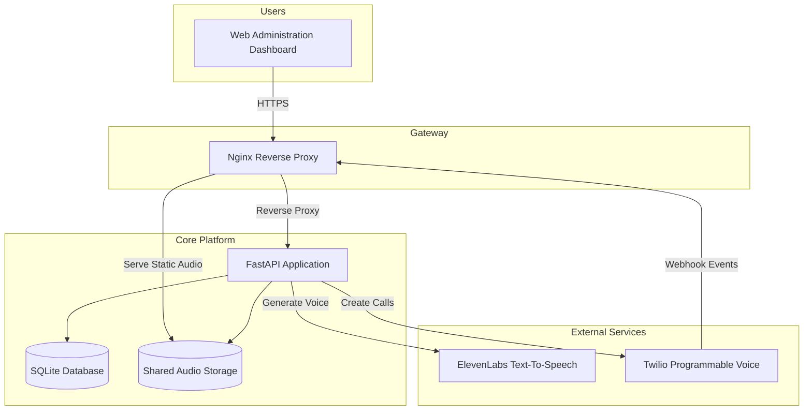

# PetConnect Voice Outreach Platform

An enterprise-grade AI-powered outbound voice communication platform built with FastAPI for veterinary clinics, pet insurance providers, and animal healthcare organizations. The platform automates personalized outbound phone campaigns, generates natural speech using ElevenLabs, manages Twilio Voice workflows, tracks customer interactions, and seamlessly transfers qualified callers to live support representatives.

---

# 🏗 System Architecture



---

# 🚀 Platform Overview

The PetConnect Voice Outreach Platform automates outbound phone campaigns by combining AI speech synthesis, telephony automation, and administrator workflow management into a single production-ready application.

The platform enables organizations to:

- Import customer contact records from CSV files
- Generate personalized voice recordings using AI
- Automatically place outbound phone calls
- Handle IVR interactions
- Connect interested callers to live agents
- Record call outcomes
- Export campaign reports

The solution is optimized for veterinary payment reminders, insurance follow-ups, appointment confirmations, customer notifications, and other outbound communication workflows.

---

# ✨ Core Features

## AI Voice Generation

- ElevenLabs Text-to-Speech integration
- Dynamic personalized messages
- Audio caching
- Automatic voice reuse
- High-quality MP3 generation

---

## Automated Calling

- Twilio Programmable Voice
- Bulk outbound dialing
- Campaign execution
- Personalized greetings
- Automatic retry workflow
- Live status tracking

---

## Interactive Voice Response (IVR)

- DTMF keypad handling
- Transfer interested callers
- Custom voice prompts
- Call branching
- Call completion tracking

---

## Campaign Management

- CSV import
- Batch processing
- Campaign execution
- Result exports
- Call history
- Progress monitoring

---

## Secure Administration

- JWT Authentication
- Secure cookies
- Password hashing
- Session management
- Administrator dashboard

---

# 🛠 Technology Stack

## Backend

- Python 3.11
- FastAPI
- Uvicorn

## Database

- SQLite

## Authentication

- JWT
- bcrypt

## Telephony

- Twilio Voice API
- TwiML

## AI Services

- ElevenLabs Text-to-Speech

## Reverse Proxy

- Nginx

## Storage

- CSV
- JSON
- Local Audio Cache

## Containerization

- Docker
- Docker Compose

---

# 📂 Project Structure

```text
petconnect-voice-platform/

├── ai-codebase/
│
├── audio/
│   ├── Cached AI generated voice files
│
├── output_results/
│   ├── Campaign reports
│
├── config.py
├── main.py
├── login.html
├── index.html
├── Dockerfile
├── docker-entrypoint.sh
├── .env.example
│
├── nginx/
│   └── nginx.conf
│
├── docker-compose.yml
├── docker-compose.dev.yml
├── docker-compose.prod.yml
│
└── README.md
```

---

# ⚙ System Components

## FastAPI Application

Responsible for:

- Authentication
- Campaign execution
- CSV parsing
- Audio generation
- Twilio integration
- Reporting
- REST API
- Dashboard backend

---

## Nginx

Responsible for:

- Reverse proxy
- SSL termination
- Audio streaming
- Static asset delivery
- Security headers

---

## SQLite Database

Stores:

- Administrator accounts
- Authentication information
- Session data

---

## Audio Cache

Stores:

- Generated MP3 files
- Cached personalized messages

---

# 🚀 Quick Start

## Prerequisites

Install:

- Docker
- Docker Compose

Obtain:

- Twilio Account
- ElevenLabs API Key

---

## Clone Repository

```bash
git clone https://github.com/your-company/petconnect-voice-platform.git

cd petconnect-voice-platform
```

---

## Configure Environment

Copy the template

```bash
cp ai-codebase/.env.example ai-codebase/.env
```

Update all required environment variables.

---

## Build

```bash
docker compose build
```

---

## Start Services

```bash
docker compose up -d
```

---

## Stop Services

```bash
docker compose down
```

---

## View Logs

```bash
docker compose logs -f
```

---

## Access Dashboard

```
http://localhost
```

---

# 🌍 Environment Variables

| Variable | Description | Required |
|------------|-------------|----------|
| TWILIO_ACCOUNT_SID | Twilio Account SID | ✅ |
| TWILIO_AUTH_TOKEN | Twilio Auth Token | ✅ |
| TWILIO_PHONE_NUMBER | Outbound Phone Number | ✅ |
| ELEVENLABS_API_KEY | ElevenLabs API Key | ✅ |
| ELEVENLABS_VOICE_ID | Voice Profile | No |
| BASE_URL | Public HTTPS URL | ✅ |
| HUMAN_AGENT_NUMBER | Transfer Destination | ✅ |
| COMMON_MESSAGE_TEXT | Default Voice Message | ✅ |
| JWT_SECRET_KEY | JWT Signing Secret | ✅ |

---

# 🔄 Call Processing Workflow

```text
Import CSV
      │
      ▼
Generate Personalized Message
      │
      ▼
Generate AI Audio
      │
      ▼
Cache Audio
      │
      ▼
Initiate Twilio Call
      │
      ▼
Customer Answers
      │
      ▼
Play Recording
      │
      ▼
Wait for IVR Input
      │
      ├────────► Transfer to Agent
      │
      └────────► Complete Call
      │
      ▼
Save Results
      │
      ▼
Export Reports
```

---

# 🔒 Security

The platform incorporates multiple layers of security suitable for production deployments.

### Authentication

- JWT authentication
- HTTP-only cookies
- Secure session handling
- Password hashing using bcrypt

---

### Container Security

- Non-root container execution
- Isolated Docker network
- Environment variable separation

---

### Reverse Proxy Security

Configured Nginx security headers include:

- X-Frame-Options
- X-Content-Type-Options
- Referrer-Policy
- Content-Security-Policy

---

# 📊 Performance Optimizations

## Audio Caching

Generated AI audio files are cached locally, preventing repeated requests to ElevenLabs and reducing API usage.

---

## Static File Delivery

Nginx serves audio assets directly without routing through FastAPI, minimizing latency and reducing backend workload.

---

## Sequential Campaign Processing

Outbound calls are processed sequentially to:

- Respect Twilio API rate limits
- Improve delivery reliability
- Prevent excessive concurrent connections

---

# 📈 Production Deployment

The project includes:

- Multi-stage Docker images
- Production Docker Compose configuration
- Development Docker Compose configuration
- Nginx reverse proxy
- Environment-based configuration
- Shared persistent audio volume

---

# 📋 Typical Use Cases

- Veterinary payment reminders
- Pet insurance notifications
- Appointment confirmations
- Membership renewals
- Billing follow-ups
- Customer engagement campaigns
- Automated reminder calls
- Service renewal notifications

---

# 📄 License

This project is intended for enterprise deployment and internal organizational use. Customize licensing terms according to your organization's requirements.